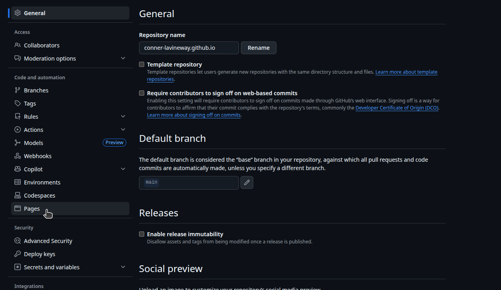
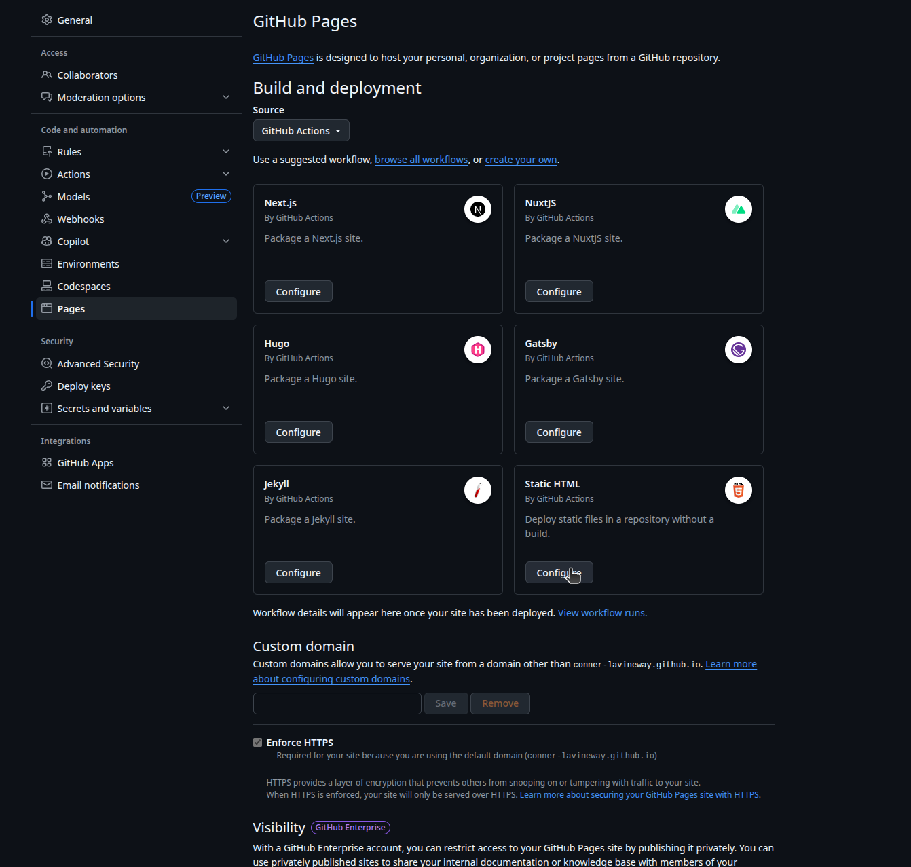
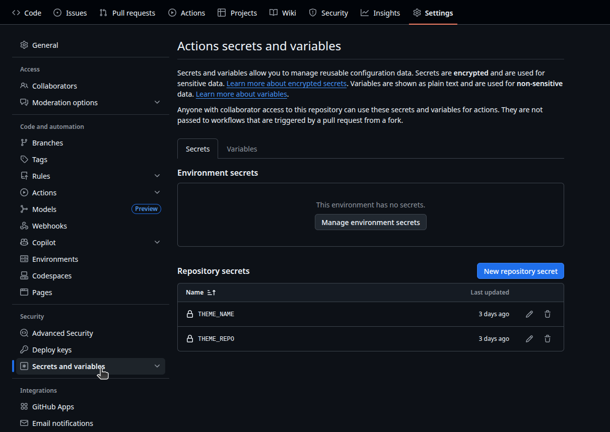

# Static Site Hosting with GitHub Pages and Pelican

This is a general purpose walk through of how to start hosting a static site generated using Pelican and hosted on GitHub pages, suitable for anyone with a beginner level understanding of command line interfaces and GitHub.

## Requirements:
- Python 3.9 or greater
- A GitHub Account
- A basic understanding of command line
- An understanding of the Markdown language
- An Internet Connection (If you're reading this congratulations! You likely have this)

### Some Assumptions
I run Linux (Specifically Ubuntu), I assume you are running this as well, a different OS may use different commands  
[A guide for Windows](https://docs.pelicanplatform.org/install/windows)  
[A guide for MacOS](https://docs.pelicanplatform.org/install/macos)  
## Instructions:
### 1. Setup:
Set up and activate a python virtual environment:  
```
python -m venv venv
source venv/bin/activate
```
Install Pelican and Markdown:
```
python -m pip install "pelican[markdown]"
```
### 2. Site Generation
After installing Pelican you need a project to work on, to start create a folder that you'll work out of
```
mkdir ~/projects/mysite
cd ~/projects/mysite
```
While still in your virtual environment run the `pelican-quickstart` command
```
pelican-quickstart
```
This will guide you through setting up a Pelican site  

This will create a set of folders for you to use to automatically generate a static site compatible with GitHub Pages.  

To generate a site using Pelican ensure your virtual environment is active and run the make files custom commands:
```
source venv/bin/activate #Activate your virtual envoiroment
pelican content #generate your site
pelican --listen #preview your site
```

This will generate a local preview of your site, to do this in one command use:
```
pelican -r -l 
```

### 3. Page creation
To create pages simply write a regular markdown file in your preferred markdown editor and save them to the 'content' folder of your pelican directory. To add images to your pages make a images folder in the content folder and reference them in the markdown pages using:
``

While making your page you can add metadata to it by adding to the top of the file.
```
Title:   
Date: 
Category:   
Tags:   
Slug:   
Author: 
```
**For pelican to recognize your page it must have a title.**
### 4. Hosting through GitHub Pages
1. To host a site using GitHub Pages first make a repository named `username.github.io`
2. Go to the repository settings and find the 'Pages' sub-tab 
3. Set the build and deployment to 'GitHub Actions'
4. Select the 'Static HTML' suggested workflow, we will be editing this file 
5. My YML file is as follows:
```
# Simple workflow for deploying static content to GitHub Pages
name: Deploy static content to Pages

on:
  # Runs on pushes targeting the default branch
  push:
    branches: ["main"]

  # Allows you to run this workflow manually from the Actions tab
  workflow_dispatch:

# Sets permissions of the GITHUB_TOKEN to allow deployment to GitHub Pages
permissions:
  contents: read
  pages: write
  id-token: write

# Allow only one concurrent deployment, skipping runs queued between the run in-progress and latest queued.
# However, do NOT cancel in-progress runs as we want to allow these production deployments to complete.
concurrency:
  group: "pages"
  cancel-in-progress: false

jobs:
  build:
    runs-on: ubuntu-latest
    steps:
      - name: Checkout
        uses: actions/checkout@v4

      - name: Setup Python
        uses: actions/setup-python@v5
        with:
          python-version: '3.x'

      - name: Install dependencies
        run: |
          python -m pip install --upgrade pip
          echo "Install dependencies"
          pip install -r requirements.txt
          echo "Clone repo with pelican theme"
          git clone ${{ secrets.THEME_REPO }}
          echo "Install pelican theme"
          pelican-themes --install ${{ secrets.THEME_NAME }}
        env:
          PELICAN_THEME_NAME: ${{ secrets.THEME_NAME }}
          PELICAN_THEME_REPO: ${{ secrets.THEME_REPO }}

      - name: Build with Pelican
        run: make publish

      - name: Setup Pages
        uses: actions/configure-pages@v5

      - name: Upload artifact
        uses: actions/upload-pages-artifact@v3
        with:
          path: 'output'

  deploy:
    environment:
      name: github-pages
      url: ${{ steps.deployment.outputs.page_url }}
    runs-on: ubuntu-latest
    needs: build
    steps:
      - name: Deploy to GitHub Pages
        id: deployment
        uses: actions/deploy-pages@v4
```
The only area changed is the 'jobs:' section

First add `build:`
```
build:
    runs-on: ubuntu-latest
    steps:
      - name: Checkout
        uses: actions/checkout@v4

      - name: Setup Python
        uses: actions/setup-python@v5
        with:
          python-version: '3.x'

      - name: Install dependencies
        run: |
          python -m pip install --upgrade pip
          echo "Install dependencies"
          pip install -r requirements.txt
          echo "Clone repo with pelican theme"
          git clone ${{ secrets.THEME_REPO }}
          echo "Install pelican theme"
          pelican-themes --install ${{ secrets.THEME_NAME }}
        env:
          PELICAN_THEME_NAME: ${{ secrets.THEME_NAME }}
          PELICAN_THEME_REPO: ${{ secrets.THEME_REPO }}

      - name: Build with Pelican
        run: make publish

      - name: Setup Pages
        uses: actions/configure-pages@v5

      - name: Upload artifact
        uses: actions/upload-pages-artifact@v3
        with:
          path: 'output'
```

This makes a virtual machine that then installs both Python and Pelican, it then reads a requirements file that contains:
```
pelican[markdown]
markdown
```

Next it installs a selected theme, themes can be found [Here](https://github.com/getpelican/pelican-themes). Once you select a theme add it to your repositories 'Secrets'

Add 2 secrets, call the first one THEME_REPO and paste your chosen theme repository into it. Call the second one THEME_NAME and put the name of your theme into it.

I used: https://github.com/alexandrevicenzi/Flex

After than the next steps make the site and push it to the output folder, and deploys the output folder to a website called `username.github.io` in my case it goes to: https://conner-lavineway.github.io/

## Further Readings
[Pelican Docs](https://docs.getpelican.com/en/latest/quickstart.html)
[Markdown Guide](https://www.markdownguide.org/getting-started/)
[Markdown Tutorial](https://www.markdowntutorial.com/)
[Guide to Pelican and GitHub Pages](https://vdmitriyev.github.io/blog/getting-started-with-pelican-and-github-pages.html)
## FAQ
**Q: Do I have to use GitHub Pages?**  
A: You don't! since Pelican generates a static site you can use any hosting service or Forge with built-in static site hosting. Other popular Forges with this feature are:  [Codeberg](https://codeberg.org/) and [Gitlab](https://about.gitlab.com/).

**Q: How can I update my site if its already hosted**
A: With this set up it is as simple as adding in a new page, the script is written in a way that causes the site to update any time the repository is updated, that includes adding, removing, and changing pages!

## Credits:

Themes: https://github.com/alexandrevicenzi/Flex 

Proof readers:  
Izzy Elskamp  
Christian Javen Samson
