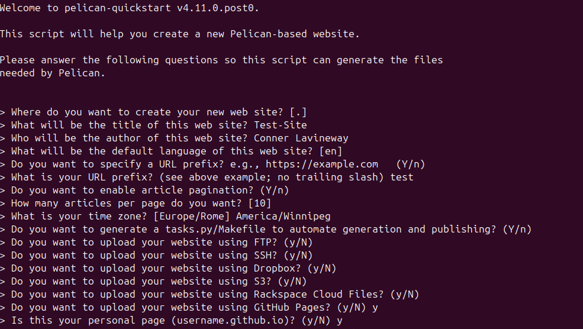

# Static Site Hosting with GitHub Pages and Pelican

This is a general purpose walk through of how to start hosting a static site generated using Pelican and hosted on GitHub pages, suitable for anyone with a beginner level understanding of command line interfaces and GitHub.

## Requirements:
- Python 3.9 or greater
- A GitHub Account
- A basic understanding of command line
- An understanding of the Markdown language
- An Internet Connection (If you're reading this congratulations! You likely have this)

### Some Assumptions
I run Linux (Specifically Ubuntu), I assume you are running this as well, a different OS may use different commands  
[A guide for Windows](https://docs.pelicanplatform.org/install/windows)  
[A guide for MacOS](https://docs.pelicanplatform.org/install/macos)  
## Instructions:
### 1. Setup:
Set up and activate a python virtual environment:  
```
python -m venv venv
source venv/bin/activate
```
Install Pelican and Markdown:
```
python -m pip install "pelican[markdown]"
```
### 2. Site Generation
After installing Pelican you need a project to work on, to start create a folder that you'll work out of
```
mkdir ~/projects/mysite
cd ~/projects/mysite
```
While still in your virtual environment run the `pelican-quickstart` command
```
pelican-quickstart
```
This will guide you through setting up a Pelican site  

This will create a set of folders for you to use to automatically generate a static site compatible with GitHub Pages.  

To generate a site using Pelican ensure your virtual environment is active and run the make files custom commands:
```
source venv/bin/activate #Activate your virtual envoiroment
pelican content #generate your site
pelican --listen #preview your site
```

This will generate a local preview of your site, to do this in one command use:
```
pelican -r -l 
```

### 3. Page creation
To create pages simply write a regular markdown file in your preferred markdown editor and save them to the 'content' folder of your pelican directory. To add images to your pages make a images folder in the content folder and reference them in the markdown pages using:
``

While making your page you can add metadata to it by adding to the top of the file.
```
Title:   
Date: 
Category:   
Tags:   
Slug:   
Author: 
```
For pelican to recognize your page it must have a title.
### 4. Hosting through GitHub Pages
To host a site using GitHub Pages first make a repository named `username.github.io` 


## Credits:

Proof readers:
Izzy Elskamp
Christian Javen Samson
